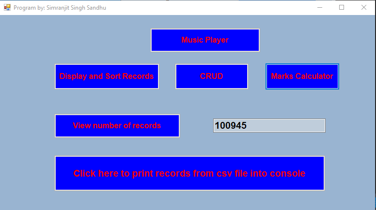
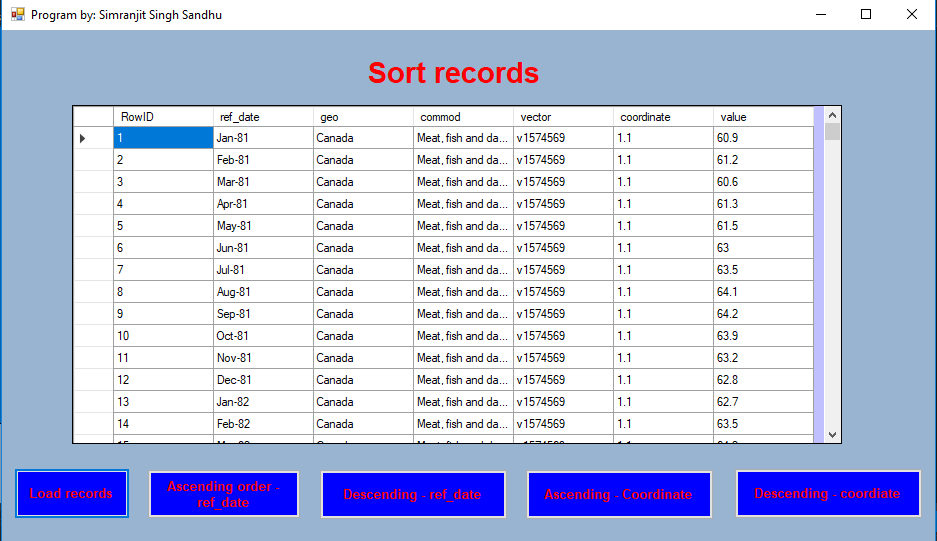

# CST8333_FinalProject

It is a project developed using C# language that demonstrates following:
-	Connect with database containing records from provided dataset
-	Create new records into database, update and delete records, displays all records in datagridview.
-	Counts total number of records that database contains.
-	Displays csv file records into console directly.
-	Sort the records in ascending and descending order using two columns of database
-	Calculates the average marks of two courses by taking input from user. 

## Images

#### 1. Main Page

#### 2. CRUD

#### 3. Sort Records

#### 4. Marks Calculator

